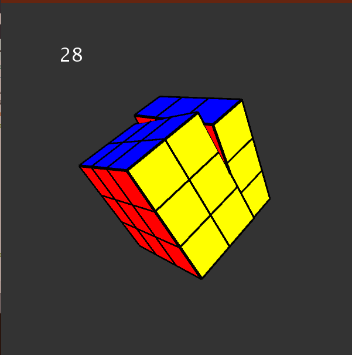

# Rubicks_Cube
Here this rubicks cube project is done using **Processing** IDE.
As we are making it as a 3D rotation cude ... we are using **PeasyCam** to get the visualization.

<p align="center"></p>

we will be creating a Matrix to take and move for every perticualar position..
```bash
PMatrix3D matrix;
  int x = 0;
  int y = 0;
  int z = 0;
  color c;
  Face[] faces = new Face[6];
  ```
  and the faces having thier possible chances of respective color:
  ```bash
  faces[0] = new Face(new PVector(0, 0, -1), color(0, 0, 255));
  faces[1] = new Face(new PVector(0, 0, 1), color(0, 255, 0));
  faces[2] = new Face(new PVector(0, 1, 0), color(255, 255, 255));
  faces[3] = new Face(new PVector(0, -1, 0), color(255, 255, 0));
  faces[4] = new Face(new PVector(1, 0, 0), color(255, 150, 0));
  faces[5] = new Face(new PVector(-1, 0, 0), color(255, 0, 0));
  ```
  for every move when the face is turned.. it has to turn around by 90 degress..
  ```bash
  void turnFacesY(int dir) {
    for (Face f : faces) {
      f.turnY(dir*HALF_PI); 
    }
  }
  ```
  this 3DPMatrix should be continuously updated for every change in face or in move...
  these are the so called every possible move that the perticular pixel can take:
  ```bash
  Move[] allMoves = new Move[] {
  new Move(0, 1, 0, 1), 
  new Move(0, 1, 0, -1), 
  new Move(0, -1, 0, 1), 
  new Move(0, -1, 0, -1), 
  new Move(1, 0, 0, 1), 
  new Move(1, 0, 0, -1), 
  new Move(-1, 0, 0, 1), 
  new Move(-1, 0, 0, -1), 
  new Move(0, 0, 1, 1), 
  new Move(0, 0, 1, -1), 
  new Move(0, 0, -1, 1), 
  new Move(0, 0, -1, -1) 
};
```
and after each turn the colors that were once on one side have to now **Translated** to another side to taht respective turn..
so as per that turn the function should command to rotate by 90 degrees and also to translate them:
```bash
void turnX(int index, int dir) {
  for (int i = 0; i < cube.length; i++) {
    Cubie qb = cube[i];
    if (qb.x == index) {
      PMatrix2D matrix = new PMatrix2D();
      matrix.rotate(dir*HALF_PI);
      matrix.translate(qb.y, qb.z);
      qb.update(qb.x, round(matrix.m02), round(matrix.m12));
      qb.turnFacesX(dir);
    }
 ```
 In this way check out the code and run it for yourself...
